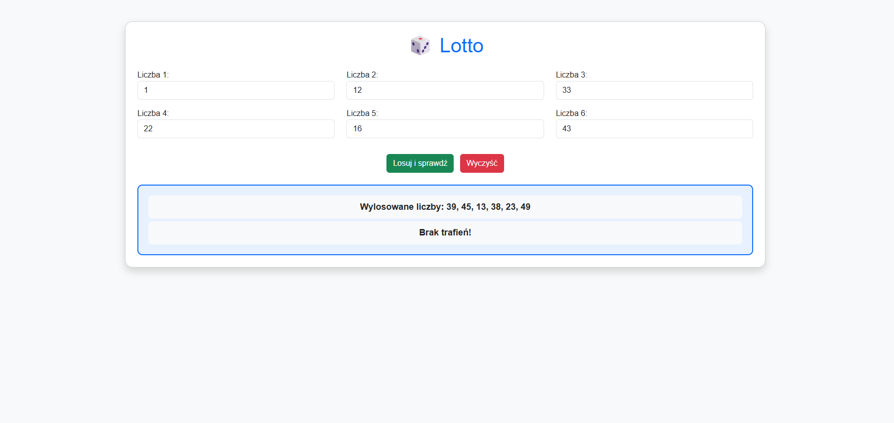

# 🎲 Lotto – Losowanie 6 z 49

Interaktywna aplikacja webowa symulująca losowanie 6 liczb z zakresu 1–49.  
Aplikacja działa w przeglądarce i umożliwia sprawdzenie ilości trafień na podstawie wprowadzonych liczb.

---

## 📌 Opis projektu

Projekt został wykonany w celu utrwalenia wiedzy z zakresu:

- pracy z formularzami HTML
- generowania liczb losowych
- logiki programowania
- manipulacji elementami DOM w JavaScript

Użytkownik może wpisać 6 liczb z zakresu 1–49, a aplikacja automatycznie losuje zestaw liczb i wyświetla wynik sprawdzenia.

---

## ⚙️ Funkcjonalności

- ✅ Losowanie 6 liczb z zakresu 1–49
- ✅ Brak powtórzeń w wylosowanych liczbach
- ✅ Sprawdzanie liczby trafień
- ✅ Wyświetlanie wylosowanych liczb
- ✅ Obsługa przycisku reset
- ✅ Czytelny i prosty interfejs

---

## 🛠️ Technologie

- HTML5  
- CSS3  
- JavaScript  
- Bootstrap 5  

---

## ▶️ Jak uruchomić projekt

1. Sklonuj repozytorium.

2. Otwórz plik `index.html` w przeglądarce.

Projekt nie wymaga instalacji ani dodatkowych narzędzi.

---

## 📷 Podgląd aplikacji

---

## 🧠 Jak działa aplikacja?

1. Użytkownik wpisuje 6 liczb w formularzu.
2. Program odczytuje wprowadzone dane.
3. Losowanych jest 6 unikalnych liczb z zakresu 1–49.
4. Program porównuje liczby użytkownika z wylosowanymi.
5. Obliczana jest liczba trafień.
6. Wynik wyświetlany jest poniżej formularza.

---

## 📂 Struktura projektu

Lotto-6-z-49-JavaScript/
│
├── index.html
├── script.js
├── styl.css
├── screenshot.png
└── README.md

---

## 👨‍💻 Autor

Bartosz Bąk  
GitHub: https://github.com/BartBak1507
